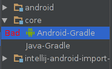

# IntelliJ Android Gradle Plugin Import Bug

## The bug

When a **pure Java** subproject (hereby called "core") is in the same base project as an **Android** subproject
(hereby called "android"), "core" will be imported into IntelliJ as "Android-Gradle".

## The repercussions

* **"core"-only builds can take over 10x longer than they need to, because they do irrelevant android-related processing**[1]
** This is incredibly relevant if most of the project is in pure-Java, and unit tests need to be run frequently
* The project still builds, it just takes longer

## How to reproduce

1. Open IntelliJ/Android Studio
2. Import the root `build.gradle` from this project
3. Ignore the errors about "source sets", it's because "Create separate module per source set" is enabled by default on-import
4. Check "Project Structure", then look at Modules|core: there's an "Android-Gradle" section (which shouldn't be there)
5. Run the tests in "core" (Right click on core|src|test|java, hit "Run 'All Tests'", (should perform "Make", but also "Gradle build")

## How to feel the speed/workaround

6. Go to "Project Structure", Delete "Android-Gradle" from Modules|core
7. Run the tests in "core" again. IntelliJ should only do a "Make", and run the tests immediately

## Video

[Video.webm](Two minute demonstration)